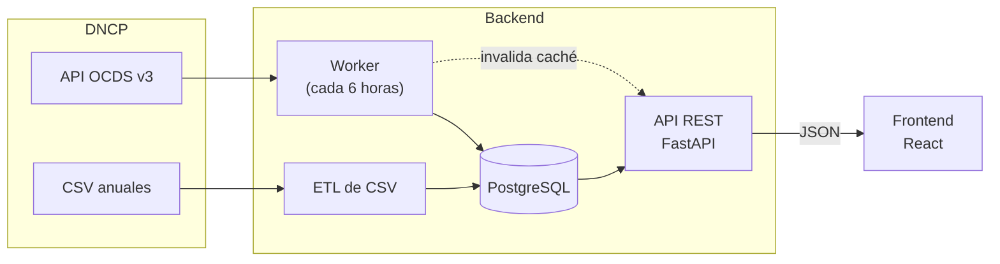

# Control Ciudadano DNCP

Indicadores de riesgo (red flags) para las contrataciones públicas de Paraguay. Toma los datos
abiertos de la Dirección Nacional de Contrataciones Públicas (DNCP) en formato OCDS, los guarda en
una base relacional, calcula tres indicadores de la guía de Open Contracting Partnership y los
muestra en una aplicación web para la ciudadanía.

Trabajo Final de Grado en Informática, Universidad Autónoma de Asunción (UAA).

## Indicadores

- R018, única oferta: porcentaje de licitaciones competitivas con un solo oferente.
- R063, contrato no publicado: porcentaje de procesos con algún contrato activo sin el documento
  firmado publicado.
- R064, contrato modificado: porcentaje de procesos con algún contrato firmado que tuvo enmiendas.

Los tres cuentan por proceso de contratación, como la guía de OCP. Un valor alto no prueba una
irregularidad: indica dónde conviene mirar.

## Arquitectura



1. El histórico se carga una vez desde los CSV anuales de la DNCP.
2. Un worker consulta la API de la DNCP cada 6 horas y guarda los procesos nuevos o modificados.
3. La API calcula los indicadores con SQL.
4. El frontend los muestra con filtros por año, institución y método de contratación.

## Carpetas

- [`backend/`](backend/): worker, ETL, base de datos y API (Python, FastAPI, PostgreSQL). Ver
  [`backend/README.md`](backend/README.md).
- [`frontend/`](frontend/): aplicación web (React, Chakra UI, TanStack Query). Ver
  [`frontend/README.md`](frontend/README.md).
- [`docs/`](docs/):
  - [`api_dncp_fechas_y_limites.md`](docs/api_dncp_fechas_y_limites.md): cómo se comporta la API
    de la DNCP (fechas, paginación, límites), medido contra la API real.
  - [`sincronizacion_y_retencion.md`](docs/sincronizacion_y_retencion.md): cómo funciona la
    sincronización y qué versión de cada proceso se guarda.
  - [`duplicados_historial_csv.md`](docs/duplicados_historial_csv.md): por qué el histórico CSV
    trae dos versiones de algunos procesos.

## Inicio rápido

Hace falta Docker y Node.js 22.12+.

La primera vez hay que cargar el histórico de los CSV antes de levantar el worker. Los pasos
están en [`backend/README.md`](backend/README.md#primera-vez-base-vacía). Después:

```bash
# backend: base, API y worker
cd backend
docker compose -f docker-compose.yml -f docker-compose.local.yml up -d
# API en http://localhost:8000 (Swagger en /docs)

# frontend
cd ../frontend
cp .env.example .env
npm install
npm run dev
# http://localhost:5173
```
