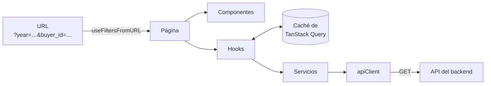

# Control Ciudadano DNCP - Frontend

Aplicación web que muestra los indicadores de riesgo (red flags) de las contrataciones públicas de
Paraguay. Los indicadores los calcula el backend a partir de los datos abiertos de la DNCP en
formato OCDS.

Está pensada para personas sin conocimientos de compras públicas. Cada indicador se explica en
palabras simples, con su evolución mes a mes, las instituciones y proveedores con más casos y el
listado de procesos, cada uno con un enlace a su registro en la DNCP.

Los indicadores no acusan a nadie: señalan dónde conviene mirar.

Proyecto académico de la Universidad Autónoma de Asunción (UAA).

## Indicadores

| Ruta | Indicador | Fórmula |
|------|-----------|---------|
| `/r018` | R018: única oferta | Licitaciones competitivas con un solo oferente / licitaciones competitivas |
| `/r063` | R063: contrato no publicado | Procesos con algún contrato activo sin documento firmado / procesos con contratos activos |
| `/r064` | R064: contrato modificado | Procesos con algún contrato enmendado / procesos con contratos activos o terminados |

Los tres cuentan por proceso de contratación. La definición completa está en el
[README del backend](../backend/README.md#indicadores-de-riesgo).

Cada página tiene:

- una explicación del indicador;
- el KPI: total evaluado, casos con alerta y porcentaje;
- la serie mensual;
- el ranking de instituciones (Top 10 y tabla completa). Al hacer clic en una institución se
  filtra la página y el ranking pasa a mostrar sus unidades de contratación;
- el ranking de proveedores (solo R018);
- el listado de casos con el enlace "Ver fuente".

La página de inicio (`/`) muestra el KPI histórico de los tres indicadores.

## Stack

- React 19 y Vite 8
- Chakra UI 3 (con `next-themes` para el modo oscuro)
- TanStack Query 5 (pedidos a la API y caché)
- React Router 7
- Recharts 3 (solo la serie mensual; los rankings son HTML)
- lucide-react (iconos)
- ESLint, Prettier, Vitest y Testing Library

Las versiones exactas están en [`package.json`](package.json).

## Requisitos

- Node.js 22.12 o superior (lo pide Vite 8) y npm. Con nvm: `nvm use` (lee `.nvmrc`).
- El backend corriendo, por defecto en `http://127.0.0.1:8000`. Ver
  [`../backend/README.md`](../backend/README.md).

## Configuración

```bash
cp .env.example .env
```

La única variable es `VITE_API_BASE_URL`, la URL de la API (por defecto `http://127.0.0.1:8000`).
Se fija al compilar: si cambia, hay que volver a hacer el build. Si falta, la aplicación no arranca
y lo avisa en la consola del navegador.

## Ejecución

```bash
npm install
npm run dev        # http://localhost:5173
npm run build      # build en dist/
npm run preview    # sirve el build en http://localhost:4173
npm run lint
npm run format
npm test           # npm run test:watch para modo interactivo
```

El build genera `dist/stats.html` con el peso de cada dependencia y lo abre en el navegador. Con
`CI=1 npm run build` no lo abre.

## Estructura

```
src/
├── main.jsx            # QueryClient y proveedor de Chakra
├── App.jsx             # rutas
├── layouts/            # barra de navegación y pie
├── pages/              # Home, IndicatorR018, IndicatorR063, IndicatorR064, NotFound
├── components/         # KPI, filtros, gráficos, tablas, paginación
├── features/
│   ├── common/services # entidades, años y fecha de actualización
│   └── r0xx/services   # una función por endpoint de cada indicador
├── hooks/              # datos con caché, paginación, filtros en la URL
├── lib/                # apiClient y queryKeys
└── utils/              # formato de números, porcentajes y fechas
```

## Cómo se piden los datos



1. `useFiltersFromURL` lee los filtros de la URL.
2. La página pide cada bloque (KPI, serie, ranking, listado) a un hook. Los hooks son los mismos
   para los tres indicadores; cambia solo la función de servicio que reciben.
3. TanStack Query guarda cada respuesta según su query key (indicador, tipo, filtros y página), así
   que no pide dos veces lo mismo.
4. Los servicios tienen una función por endpoint y usan `apiClient`, que es el único lugar que hace
   pedidos HTTP.

Caché: los datos se consideran vigentes 5 minutos y se guardan 30; las entidades y los años, 30
minutos. Un pedido fallido se reintenta 2 veces. Como el backend se sincroniza con la DNCP cada
6 horas, no hace falta pedir más seguido.

## Filtros

Los filtros se guardan en la URL, así una vista filtrada se puede compartir o recargar:

- `year`: año (los tres indicadores)
- `buyer_id`: entidad compradora (los tres)
- `proc_method`: `open` o `selective` (R018)
- `supplier_id`: proveedor (listado de R018)

Ejemplo: `/r018?year=2024&buyer_id=<id>&proc_method=open`.

Cambiar un filtro no agrega entradas al historial del navegador. Las listas de entidades y años
vienen de la API (`/common/buyers`, `/common/years`). El buscador de entidades no distingue
mayúsculas ni tildes.

## Paginación

Los rankings completos y los listados se paginan en el backend (`limit` y `offset`), de a 10, 20,
50 o 100 filas. Al cambiar de página se sigue viendo la anterior hasta que llega la nueva. Al
cambiar los filtros se vuelve a la página 1.

El Top 10 y la primera página de la tabla del ranking son la misma consulta, así que abrir la
tabla no hace otro pedido.

## Endpoints que usa

| Endpoint | Dónde |
|----------|-------|
| `/common/buyers`, `/common/years` | Filtros |
| `/common/status` | Pie de página |
| `/r0xx/kpi` | KPI (y tarjetas del inicio) |
| `/r0xx/monthly` | Serie mensual |
| `/r0xx/top-entities` | Ranking de instituciones |
| `/r018/suppliers` | Ranking de proveedores |
| `/r018/tenders`, `/r063/processes`, `/r064/processes` | Listado de casos |

Todos reciben `year` y `buyer_id`; R018 además `proc_method`. Los paginados reciben `limit` y
`offset`. El detalle está en la documentación de la API (`/docs` del backend).

## Interfaz

- Barra de navegación fija; en el celular se vuelve un menú.
- Modo claro y oscuro. La preferencia se guarda en el navegador; si no hay, se usa la del sistema.
- Números, porcentajes y fechas en formato `es-PY`. Las fechas se muestran en hora de Paraguay.
- El pie muestra la fecha de la última actualización de los datos.
- Mientras carga se ven esqueletos. Si la API falla, cada bloque muestra un aviso con
  "Reintentar" en vez de un 0 o una tabla vacía, que se leería como "no hay riesgo".
- Accesibilidad: las filas clicables se usan con teclado (Enter o Espacio); los textos largos
  hacen salto de línea en vez de cortarse; el Top 10 es una lista HTML; al abrir "Ver todas" el
  foco pasa al título del bloque; los botones con icono tienen etiqueta.
- La página 404 vuelve al inicio a los 5 segundos.

## Tests

```bash
npm test
```

- `src/utils/format.test.js`: formato de números, porcentajes y fechas.
- `src/hooks/useFiltersFromURL.test.jsx`: lectura y escritura de filtros, y que el objeto de
  filtros no cambie entre renders si la URL es la misma.
- `src/lib/apiClient.test.js`: URL y parámetros de los pedidos, y errores HTTP y de red.

## Despliegue

`npm run build` deja en `dist/` archivos estáticos que se pueden servir desde cualquier servidor
web. El servidor tiene que devolver `index.html` para las rutas de la aplicación (por ejemplo
`/r018`); si no, recargar esa página da 404.
